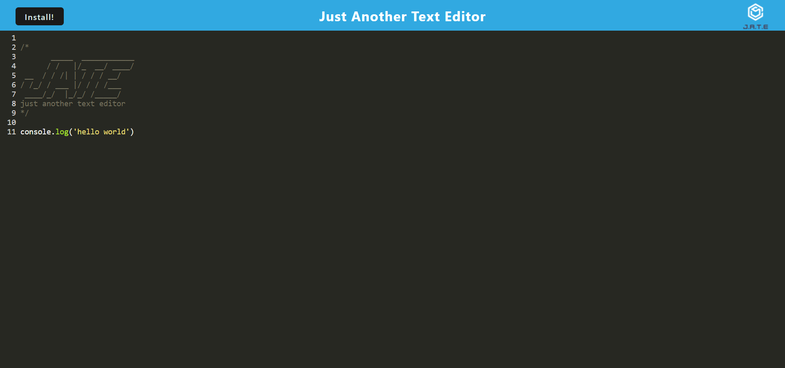

# Just Another Text Editor

## Description

This Progressive Web Application (PWA) is a text editor that runs in the browser.

## Table of Contents

2. [Usage](#usage)
4. [Contributing](#contributing)
5. [Questions](#questions)

## Usage

The application uses Webpack, IndexedDB and service worker to create a PWA that you can download and use offline. 

- Opening the application in the browser IndexedDB creates a database storage.
- Content in the text editor is saved when clicking off the DOM window and retrieved on reopening it after it's been closed.
- Clocking the install button will download the application as an icon on the desktop and allow the user to use it offline.

## Screenshot

## Contributing

Ben Growcott - [GitHub](https://github.com/BGrowcott)

## Questions

If you have any questions or suggestions please contact me via my GitHub or Email:

[GitHub](https://github.com/BGrowcott)

[Email](mailto:bg.coding101@gmail.com)

----